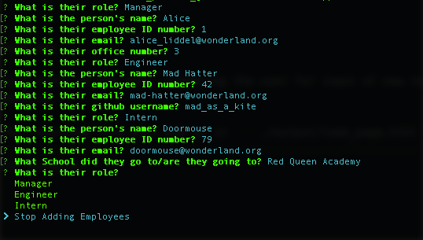
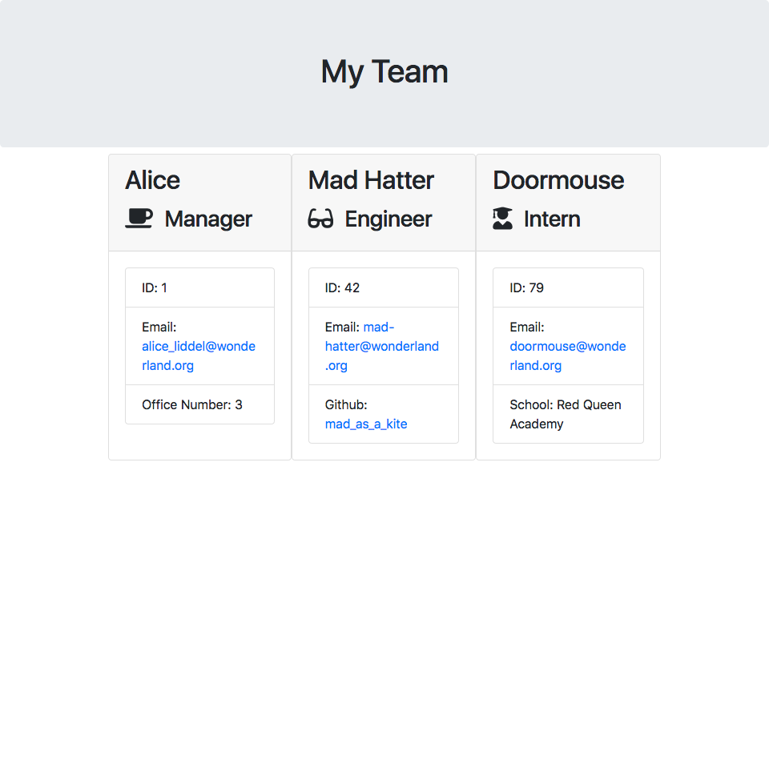

# team_profile_generator


A command line tool to generate a profile page of team members to save to your website

---
### Table Of Contents
 
* [Installation](#installation)
* [Usage](#usage)
* [Contributing](#contributing)
* [Contact](#contact)
* [License](#license)
---

## Installation
 
To run this tool, clone it from github.  Requires [Inquirer](https://www.npmjs.com/package/inquirer) for the command line prompts.

---

## Usage

```js
node app
``` 
will start up the tool, prompting the user for input of new team members.

The resulting file will end up in ``` ./output/team_page.html ```

### For example this:

### Will result in this:


---

## Testing

There are test files included with the repo using [Jest](https://www.npmjs.com/package/jest).

---

## Contributing

Feel free to fork it and suggest changes.  If you find any issues, submit them.

---

## Contact

If you have any questions or are interested in this project, you can contact me, Chris Faux, at chrisfaux95@gmail.com.  Or if you feel so inclined, check out my Github profile: [chrisfaux95](https:/github.com/chrisfaux95).
    

---

## License

This project licensed under the [MIT](https://choosealicense.com/licenses/mit/) license.
